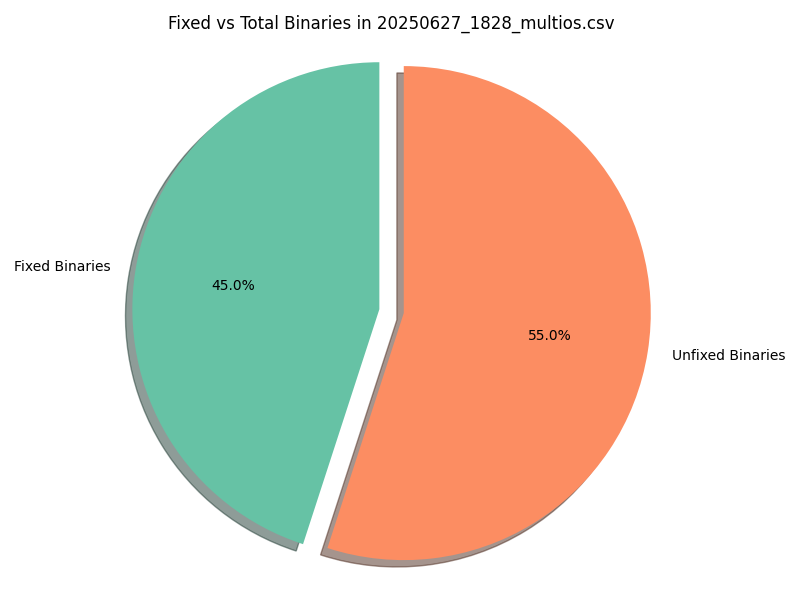

# Multios Binaries Analysis Report

| File | Fixed Binaries | Total Binaries | Ratio |
|------|----------------|----------------|-------|
| 20250319_2344_multios.csv | 9 | 20 | 0.45 |
| 20250422_2353_multios.csv | 9 | 20 | 0.45 |
| 20250921_1812_multios.csv | 9 | 20 | 0.45 |
| 20250715_1818_multios.csv | 9 | 20 | 0.45 |
| 20250627_1828_multios.csv | 9 | 20 | 0.45 |
| 20250623_1831_multios.csv | 9 | 20 | 0.45 |
| 20250717_1807_multios.csv | 9 | 20 | 0.45 |
| 20250413_2339_multios.csv | 9 | 20 | 0.45 |
| 20250815_1817_multios.csv | 9 | 20 | 0.45 |
| 20250724_1813_multios.csv | 9 | 20 | 0.45 |
| 20250418_2359_multios.csv | 9 | 20 | 0.45 |
| 20250604_0057_multios.csv | 9 | 20 | 0.45 |
| 20250308_2349_multios.csv | 9 | 20 | 0.45 |
| 20250519_0159_multios.csv | 9 | 20 | 0.45 |
| 20250404_2355_multios.csv | 9 | 20 | 0.45 |
| 20250904_1811_multios.csv | 9 | 20 | 0.45 |
| 20250320_2342_multios.csv | 9 | 20 | 0.45 |
| 20250330_2340_multios.csv | 9 | 20 | 0.45 |
| 20250601_0204_multios.csv | 9 | 20 | 0.45 |
| 20250325_2356_multios.csv | 9 | 20 | 0.45 |
| 20250218_2334_multios.csv | 9 | 20 | 0.45 |
| 20250205_2327_multios.csv | 9 | 20 | 0.45 |
| 20250619_1807_multios.csv | 9 | 20 | 0.45 |
| 20250709_1812_multios.csv | 9 | 20 | 0.45 |
| 20250719_1809_multios.csv | 9 | 20 | 0.45 |
| 20250920_1809_multios.csv | 9 | 20 | 0.45 |
| 20250923_1809_multios.csv | 9 | 20 | 0.45 |
| 20250830_1816_multios.csv | 9 | 20 | 0.45 |
| 20250401_2352_multios.csv | 9 | 20 | 0.45 |
| 20250901_1813_multios.csv | 9 | 20 | 0.45 |
| 20241218_0538_multios.csv | 9 | 20 | 0.45 |
| 20250628_1807_multios.csv | 9 | 20 | 0.45 |
| 20250208_2334_multios.csv | 9 | 20 | 0.45 |
| 20250613_0202_multios.csv | 9 | 20 | 0.45 |
| 20250126_2319_multios.csv | 9 | 20 | 0.45 |
| 20250425_2351_multios.csv | 9 | 20 | 0.45 |
| 20250917_1818_multios.csv | 9 | 20 | 0.45 |
| 20250509_0147_multios.csv | 9 | 20 | 0.45 |
| 20250710_1818_multios.csv | 9 | 20 | 0.45 |
| 20250529_0222_multios.csv | 9 | 20 | 0.45 |
| 20250204_2335_multios.csv | 9 | 20 | 0.45 |
| 20250807_1814_multios.csv | 9 | 20 | 0.45 |
| 20250129_2324_multios.csv | 9 | 20 | 0.45 |
| 20250514_0152_multios.csv | 9 | 20 | 0.45 |
| 20250723_1813_multios.csv | 9 | 20 | 0.45 |
| 20250718_1814_multios.csv | 9 | 20 | 0.45 |
| 20250606_0145_multios.csv | 9 | 20 | 0.45 |
| 20250407_2340_multios.csv | 9 | 20 | 0.45 |
| 20250504_0221_multios.csv | 9 | 20 | 0.45 |
| 20250227_2341_multios.csv | 9 | 20 | 0.45 |
| 20250217_2346_multios.csv | 9 | 20 | 0.45 |
| 20250505_0142_multios.csv | 9 | 20 | 0.45 |
| 20250408_2345_multios.csv | 9 | 20 | 0.45 |
| 20250329_2336_multios.csv | 9 | 20 | 0.45 |
| 20250828_1814_multios.csv | 9 | 20 | 0.45 |
| 20250821_1811_multios.csv | 9 | 20 | 0.45 |
| 20250510_0156_multios.csv | 9 | 20 | 0.45 |
| 20250730_1837_multios.csv | 9 | 20 | 0.45 |
| 20250810_1812_multios.csv | 9 | 20 | 0.45 |
| 20250824_1811_multios.csv | 9 | 20 | 0.45 |
| 20250808_1806_multios.csv | 9 | 20 | 0.45 |
| 20250415_2344_multios.csv | 9 | 20 | 0.45 |
| 20250219_2349_multios.csv | 9 | 20 | 0.45 |
| 20250222_2346_multios.csv | 9 | 20 | 0.45 |
| 20250515_0155_multios.csv | 9 | 20 | 0.45 |
| 20250814_1809_multios.csv | 9 | 20 | 0.45 |
| 20250619_0212_multios.csv | 9 | 20 | 0.45 |
| 20250223_2344_multios.csv | 9 | 20 | 0.45 |
| 20250215_2335_multios.csv | 9 | 20 | 0.45 |
| 20250909_1811_multios.csv | 9 | 20 | 0.45 |
| 20250303_2354_multios.csv | 9 | 20 | 0.45 |
| 20250911_1815_multios.csv | 9 | 20 | 0.45 |
| 20250629_1823_multios.csv | 9 | 20 | 0.45 |
| 20250708_1817_multios.csv | 9 | 20 | 0.45 |
| 20250528_0158_multios.csv | 9 | 20 | 0.45 |
| 20250419_2359_multios.csv | 9 | 20 | 0.45 |
| 20250121_2317_multios.csv | 9 | 20 | 0.45 |
| 20241219_0540_multios.csv | 9 | 20 | 0.45 |
| 20250120_2321_multios.csv | 9 | 20 | 0.45 |
| 20250714_1814_multios.csv | 9 | 20 | 0.45 |
| 20250309_2345_multios.csv | 9 | 20 | 0.45 |
| 20250624_1814_multios.csv | 9 | 20 | 0.45 |
| 20250905_1820_multios.csv | 9 | 20 | 0.45 |
| 20250817_1821_multios.csv | 9 | 20 | 0.45 |
| 20250517_0154_multios.csv | 9 | 20 | 0.45 |
| 20250916_1805_multios.csv | 9 | 20 | 0.45 |
| 20250706_1812_multios.csv | 9 | 20 | 0.45 |
| 20250525_0201_multios.csv | 9 | 20 | 0.45 |
| 20250316_2342_multios.csv | 9 | 20 | 0.45 |
| 20250312_2337_multios.csv | 9 | 20 | 0.45 |
| 20250225_2348_multios.csv | 9 | 20 | 0.45 |
| 20250725_1819_multios.csv | 9 | 20 | 0.45 |
| 20250908_1805_multios.csv | 9 | 20 | 0.45 |
| 20241221_0541_multios.csv | 9 | 20 | 0.45 |
| 20250806_1819_multios.csv | 9 | 20 | 0.45 |
| 20250323_2343_multios.csv | 9 | 20 | 0.45 |
| 20250503_0140_multios.csv | 9 | 20 | 0.45 |
| 20250611_0223_multios.csv | 9 | 20 | 0.45 |
| 20250321_2343_multios.csv | 9 | 20 | 0.45 |
| 20250327_2346_multios.csv | 9 | 20 | 0.45 |
| 20250811_1818_multios.csv | 9 | 20 | 0.45 |
| 20250913_1810_multios.csv | 9 | 20 | 0.45 |
| 20250608_0150_multios.csv | 9 | 20 | 0.45 |
| 20250625_1808_multios.csv | 9 | 20 | 0.45 |
| 20250202_2331_multios.csv | 9 | 20 | 0.45 |
| 20250703_1809_multios.csv | 9 | 20 | 0.45 |
| 20250531_0153_multios.csv | 9 | 20 | 0.45 |
| 20250128_2316_multios.csv | 9 | 20 | 0.45 |
| 20250907_1816_multios.csv | 9 | 20 | 0.45 |
| 20250826_1815_multios.csv | 9 | 20 | 0.45 |
| 20250918_1812_multios.csv | 9 | 20 | 0.45 |
| 20250827_1810_multios.csv | 9 | 20 | 0.45 |
| 20250424_0001_multios.csv | 9 | 20 | 0.45 |
| 20250302_2338_multios.csv | 9 | 20 | 0.45 |
| 20250428_0057_multios.csv | 9 | 20 | 0.45 |
| 20250206_2334_multios.csv | 9 | 20 | 0.45 |
| 20250513_0155_multios.csv | 9 | 20 | 0.45 |
| 20250224_2337_multios.csv | 9 | 20 | 0.45 |
| 20250831_1809_multios.csv | 9 | 20 | 0.45 |
| 20250609_0213_multios.csv | 9 | 20 | 0.45 |
| 20250530_0159_multios.csv | 9 | 20 | 0.45 |
| 20250131_2318_multios.csv | 9 | 20 | 0.45 |
| 20241222_0542_multios.csv | 9 | 20 | 0.45 |
| 20250119_2153_multios.csv | 9 | 20 | 0.45 |
| 20250216_2332_multios.csv | 9 | 20 | 0.45 |
| 20250722_1815_multios.csv | 9 | 20 | 0.45 |
| 20250813_1819_multios.csv | 9 | 20 | 0.45 |
| 20250512_0155_multios.csv | 9 | 20 | 0.45 |
| 20250903_1838_multios.csv | 9 | 20 | 0.45 |
| 20250825_1819_multios.csv | 9 | 20 | 0.45 |
| 20250615_0209_multios.csv | 9 | 20 | 0.45 |
| 20250209_2340_multios.csv | 9 | 20 | 0.45 |
| 20250812_1807_multios.csv | 9 | 20 | 0.45 |
| 20250213_2329_multios.csv | 9 | 20 | 0.45 |
| 20250603_0158_multios.csv | 9 | 20 | 0.45 |
| 20250527_0200_multios.csv | 9 | 20 | 0.45 |
| 20250501_0109_multios.csv | 9 | 20 | 0.45 |
| 20250130_2320_multios.csv | 9 | 20 | 0.45 |
| 20250919_1819_multios.csv | 9 | 20 | 0.45 |
| 20250502_0125_multios.csv | 9 | 20 | 0.45 |
| 20250912_1813_multios.csv | 9 | 20 | 0.45 |
| 20250325_0000_multios.csv | 9 | 20 | 0.45 |
| 20250612_0206_multios.csv | 9 | 20 | 0.45 |
| 20250818_1806_multios.csv | 9 | 20 | 0.45 |
| 20250331_2346_multios.csv | 9 | 20 | 0.45 |
| 20250521_0150_multios.csv | 9 | 20 | 0.45 |
| 20250702_1813_multios.csv | 9 | 20 | 0.45 |
| 20250226_2340_multios.csv | 9 | 20 | 0.45 |
| 20250402_2341_multios.csv | 9 | 20 | 0.45 |
| 20250721_1818_multios.csv | 9 | 20 | 0.45 |
| 20250803_1811_multios.csv | 9 | 20 | 0.45 |
| 20250506_0209_multios.csv | 9 | 20 | 0.45 |
| 20250727_1832_multios.csv | 9 | 20 | 0.45 |
| 20250711_1837_multios.csv | 9 | 20 | 0.45 |
| 20250228_2337_multios.csv | 9 | 20 | 0.45 |
| 20250607_0202_multios.csv | 9 | 20 | 0.45 |
| 20250914_1812_multios.csv | 9 | 20 | 0.45 |
| 20250801_1848_multios.csv | 9 | 20 | 0.45 |
| 20250617_0233_multios.csv | 9 | 20 | 0.45 |
| 20250829_1807_multios.csv | 9 | 20 | 0.45 |
| 20250910_1811_multios.csv | 9 | 20 | 0.45 |
| 20250820_1811_multios.csv | 9 | 20 | 0.45 |
| 20250618_0207_multios.csv | 9 | 20 | 0.45 |
| 20250311_2340_multios.csv | 9 | 20 | 0.45 |
| 20250124_2345_multios.csv | 9 | 20 | 0.45 |
| 20250630_1813_multios.csv | 9 | 20 | 0.45 |
| 20250116_1915_multios.csv | 9 | 20 | 0.45 |
| 20250304_2340_multios.csv | 9 | 20 | 0.45 |
| 20250424_2338_multios.csv | 9 | 20 | 0.45 |
| 20250125_2315_multios.csv | 9 | 20 | 0.45 |
| 20250426_2343_multios.csv | 9 | 20 | 0.45 |
| 20250524_0205_multios.csv | 9 | 20 | 0.45 |
| 20250819_1811_multios.csv | 9 | 20 | 0.45 |
| 20250620_1807_multios.csv | 9 | 20 | 0.45 |
| 20241217_0540_multios.csv | 9 | 20 | 0.45 |
| 20250212_0026_multios.csv | 9 | 20 | 0.45 |
| 20250212_2330_multios.csv | 9 | 20 | 0.45 |
| 20250123_2330_multios.csv | 9 | 20 | 0.45 |
| 20250704_1810_multios.csv | 9 | 20 | 0.45 |
| 20250516_0146_multios.csv | 9 | 20 | 0.45 |
| 20250731_1846_multios.csv | 9 | 20 | 0.45 |
| 20250403_2355_multios.csv | 9 | 20 | 0.45 |
| 20250420_2348_multios.csv | 9 | 20 | 0.45 |
| 20250214_2340_multios.csv | 9 | 20 | 0.45 |
| 20250414_2345_multios.csv | 9 | 20 | 0.45 |
| 20250809_1818_multios.csv | 9 | 20 | 0.45 |
| 20250221_0301_multios.csv | 9 | 20 | 0.45 |
| 20250417_2343_multios.csv | 9 | 20 | 0.45 |
| 20250626_1820_multios.csv | 9 | 20 | 0.45 |
| 20250816_1820_multios.csv | 9 | 20 | 0.45 |
| 20250322_2335_multios.csv | 9 | 20 | 0.45 |
| 20250409_2344_multios.csv | 9 | 20 | 0.45 |
| 20250520_0206_multios.csv | 9 | 20 | 0.45 |
| 20241220_0539_multios.csv | 9 | 20 | 0.45 |
| 20250511_0153_multios.csv | 9 | 20 | 0.45 |
| 20250726_1844_multios.csv | 9 | 20 | 0.45 |
| 20250406_2341_multios.csv | 9 | 20 | 0.45 |
| 20250729_1832_multios.csv | 9 | 20 | 0.45 |
| 20250405_2343_multios.csv | 9 | 20 | 0.45 |
| 20250712_1817_multios.csv | 9 | 20 | 0.45 |
| 20250412_2343_multios.csv | 9 | 20 | 0.45 |
| 20250805_1817_multios.csv | 9 | 20 | 0.45 |
| 20250317_2344_multios.csv | 9 | 20 | 0.45 |
| 20250526_0207_multios.csv | 9 | 20 | 0.45 |
| 20250421_2338_multios.csv | 9 | 20 | 0.45 |
| 20250705_1815_multios.csv | 9 | 20 | 0.45 |
| 20250622_1813_multios.csv | 9 | 20 | 0.45 |
| 20250522_0144_multios.csv | 9 | 20 | 0.45 |
| 20250804_1819_multios.csv | 9 | 20 | 0.45 |
| 20250315_2347_multios.csv | 9 | 20 | 0.45 |
| 20250720_1807_multios.csv | 9 | 20 | 0.45 |
| 20250122_2325_multios.csv | 9 | 20 | 0.45 |
| 20250318_2338_multios.csv | 9 | 20 | 0.45 |
| 20250301_2341_multios.csv | 9 | 20 | 0.45 |
| 20250307_2341_multios.csv | 9 | 20 | 0.45 |
| 20250616_0218_multios.csv | 9 | 20 | 0.45 |
| 20250902_1838_multios.csv | 9 | 20 | 0.45 |
| 20250707_1807_multios.csv | 9 | 20 | 0.45 |
| 20250802_1810_multios.csv | 9 | 20 | 0.45 |
| 20241225_0540_multios.csv | 9 | 20 | 0.45 |
| 20250429_0123_multios.csv | 9 | 20 | 0.45 |
| 20250906_1830_multios.csv | 9 | 20 | 0.45 |
| 20250922_1805_multios.csv | 9 | 20 | 0.45 |
| 20241223_0543_multios.csv | 9 | 20 | 0.45 |
| 20250713_1807_multios.csv | 9 | 20 | 0.45 |
| 20250127_2315_multios.csv | 9 | 20 | 0.45 |
| 20250314_2344_multios.csv | 9 | 20 | 0.45 |
| 20250207_2331_multios.csv | 9 | 20 | 0.45 |
| 20250410_2343_multios.csv | 9 | 20 | 0.45 |
| 20250915_1810_multios.csv | 9 | 20 | 0.45 |
| 20250305_2344_multios.csv | 9 | 20 | 0.45 |
| 20250201_2331_multios.csv | 9 | 20 | 0.45 |
| 20250518_0200_multios.csv | 9 | 20 | 0.45 |
| 20250313_2347_multios.csv | 9 | 20 | 0.45 |
| 20250823_1809_multios.csv | 9 | 20 | 0.45 |
| 20250716_1812_multios.csv | 9 | 20 | 0.45 |
| 20250602_0204_multios.csv | 9 | 20 | 0.45 |
| 20250306_2334_multios.csv | 9 | 20 | 0.45 |
| 20250203_2335_multios.csv | 9 | 20 | 0.45 |
| 20250610_0151_multios.csv | 9 | 20 | 0.45 |
| 20250523_0152_multios.csv | 9 | 20 | 0.45 |
| 20250310_2349_multios.csv | 9 | 20 | 0.45 |
| 20250221_2346_multios.csv | 9 | 20 | 0.45 |
| 20250621_1812_multios.csv | 9 | 20 | 0.45 |

## Fixed vs Total Binaries for 20250319_2344_multios.csv

## Fixed vs Total Binaries for 20250422_2353_multios.csv

## Fixed vs Total Binaries for 20250921_1812_multios.csv

## Fixed vs Total Binaries for 20250715_1818_multios.csv

## Fixed vs Total Binaries for 20250627_1828_multios.csv

## Fixed vs Total Binaries for 20250623_1831_multios.csv

## Fixed vs Total Binaries for 20250717_1807_multios.csv

## Fixed vs Total Binaries for 20250413_2339_multios.csv

## Fixed vs Total Binaries for 20250815_1817_multios.csv

## Fixed vs Total Binaries for 20250724_1813_multios.csv

## Fixed vs Total Binaries for 20250418_2359_multios.csv

## Fixed vs Total Binaries for 20250604_0057_multios.csv

## Fixed vs Total Binaries for 20250308_2349_multios.csv

## Fixed vs Total Binaries for 20250519_0159_multios.csv

## Fixed vs Total Binaries for 20250404_2355_multios.csv

## Fixed vs Total Binaries for 20250904_1811_multios.csv

## Fixed vs Total Binaries for 20250320_2342_multios.csv

## Fixed vs Total Binaries for 20250330_2340_multios.csv

## Fixed vs Total Binaries for 20250601_0204_multios.csv

## Fixed vs Total Binaries for 20250325_2356_multios.csv

## Fixed vs Total Binaries for 20250218_2334_multios.csv

## Fixed vs Total Binaries for 20250205_2327_multios.csv

## Fixed vs Total Binaries for 20250619_1807_multios.csv

## Fixed vs Total Binaries for 20250709_1812_multios.csv

## Fixed vs Total Binaries for 20250719_1809_multios.csv

## Fixed vs Total Binaries for 20250920_1809_multios.csv

## Fixed vs Total Binaries for 20250923_1809_multios.csv

## Fixed vs Total Binaries for 20250830_1816_multios.csv

## Fixed vs Total Binaries for 20250401_2352_multios.csv

## Fixed vs Total Binaries for 20250901_1813_multios.csv

## Fixed vs Total Binaries for 20241218_0538_multios.csv

## Fixed vs Total Binaries for 20250628_1807_multios.csv

## Fixed vs Total Binaries for 20250208_2334_multios.csv

## Fixed vs Total Binaries for 20250613_0202_multios.csv

## Fixed vs Total Binaries for 20250126_2319_multios.csv

## Fixed vs Total Binaries for 20250425_2351_multios.csv

## Fixed vs Total Binaries for 20250917_1818_multios.csv

## Fixed vs Total Binaries for 20250509_0147_multios.csv

## Fixed vs Total Binaries for 20250710_1818_multios.csv

## Fixed vs Total Binaries for 20250529_0222_multios.csv

## Fixed vs Total Binaries for 20250204_2335_multios.csv

## Fixed vs Total Binaries for 20250807_1814_multios.csv

## Fixed vs Total Binaries for 20250129_2324_multios.csv

## Fixed vs Total Binaries for 20250514_0152_multios.csv

## Fixed vs Total Binaries for 20250723_1813_multios.csv

## Fixed vs Total Binaries for 20250718_1814_multios.csv

## Fixed vs Total Binaries for 20250606_0145_multios.csv

## Fixed vs Total Binaries for 20250407_2340_multios.csv

## Fixed vs Total Binaries for 20250504_0221_multios.csv

## Fixed vs Total Binaries for 20250227_2341_multios.csv

## Fixed vs Total Binaries for 20250217_2346_multios.csv

## Fixed vs Total Binaries for 20250505_0142_multios.csv

## Fixed vs Total Binaries for 20250408_2345_multios.csv

## Fixed vs Total Binaries for 20250329_2336_multios.csv

## Fixed vs Total Binaries for 20250828_1814_multios.csv

## Fixed vs Total Binaries for 20250821_1811_multios.csv

## Fixed vs Total Binaries for 20250510_0156_multios.csv

## Fixed vs Total Binaries for 20250730_1837_multios.csv

## Fixed vs Total Binaries for 20250810_1812_multios.csv

## Fixed vs Total Binaries for 20250824_1811_multios.csv

## Fixed vs Total Binaries for 20250808_1806_multios.csv

## Fixed vs Total Binaries for 20250415_2344_multios.csv

## Fixed vs Total Binaries for 20250219_2349_multios.csv

## Fixed vs Total Binaries for 20250222_2346_multios.csv

## Fixed vs Total Binaries for 20250515_0155_multios.csv

## Fixed vs Total Binaries for 20250814_1809_multios.csv

## Fixed vs Total Binaries for 20250619_0212_multios.csv

## Fixed vs Total Binaries for 20250223_2344_multios.csv

## Fixed vs Total Binaries for 20250215_2335_multios.csv

## Fixed vs Total Binaries for 20250909_1811_multios.csv

## Fixed vs Total Binaries for 20250303_2354_multios.csv

## Fixed vs Total Binaries for 20250911_1815_multios.csv

## Fixed vs Total Binaries for 20250629_1823_multios.csv

## Fixed vs Total Binaries for 20250708_1817_multios.csv

## Fixed vs Total Binaries for 20250528_0158_multios.csv

## Fixed vs Total Binaries for 20250419_2359_multios.csv

## Fixed vs Total Binaries for 20250121_2317_multios.csv

## Fixed vs Total Binaries for 20241219_0540_multios.csv

## Fixed vs Total Binaries for 20250120_2321_multios.csv

## Fixed vs Total Binaries for 20250714_1814_multios.csv

## Fixed vs Total Binaries for 20250309_2345_multios.csv

## Fixed vs Total Binaries for 20250624_1814_multios.csv

## Fixed vs Total Binaries for 20250905_1820_multios.csv

## Fixed vs Total Binaries for 20250817_1821_multios.csv

## Fixed vs Total Binaries for 20250517_0154_multios.csv

## Fixed vs Total Binaries for 20250916_1805_multios.csv

## Fixed vs Total Binaries for 20250706_1812_multios.csv

## Fixed vs Total Binaries for 20250525_0201_multios.csv

## Fixed vs Total Binaries for 20250316_2342_multios.csv

## Fixed vs Total Binaries for 20250312_2337_multios.csv

## Fixed vs Total Binaries for 20250225_2348_multios.csv

## Fixed vs Total Binaries for 20250725_1819_multios.csv

## Fixed vs Total Binaries for 20250908_1805_multios.csv

## Fixed vs Total Binaries for 20241221_0541_multios.csv

## Fixed vs Total Binaries for 20250806_1819_multios.csv

## Fixed vs Total Binaries for 20250323_2343_multios.csv

## Fixed vs Total Binaries for 20250503_0140_multios.csv

## Fixed vs Total Binaries for 20250611_0223_multios.csv

## Fixed vs Total Binaries for 20250321_2343_multios.csv

## Fixed vs Total Binaries for 20250327_2346_multios.csv

## Fixed vs Total Binaries for 20250811_1818_multios.csv

## Fixed vs Total Binaries for 20250913_1810_multios.csv

## Fixed vs Total Binaries for 20250608_0150_multios.csv

## Fixed vs Total Binaries for 20250625_1808_multios.csv

## Fixed vs Total Binaries for 20250202_2331_multios.csv

## Fixed vs Total Binaries for 20250703_1809_multios.csv

## Fixed vs Total Binaries for 20250531_0153_multios.csv

## Fixed vs Total Binaries for 20250128_2316_multios.csv

## Fixed vs Total Binaries for 20250907_1816_multios.csv

## Fixed vs Total Binaries for 20250826_1815_multios.csv

## Fixed vs Total Binaries for 20250918_1812_multios.csv

## Fixed vs Total Binaries for 20250827_1810_multios.csv

## Fixed vs Total Binaries for 20250424_0001_multios.csv

## Fixed vs Total Binaries for 20250302_2338_multios.csv

## Fixed vs Total Binaries for 20250428_0057_multios.csv

## Fixed vs Total Binaries for 20250206_2334_multios.csv

## Fixed vs Total Binaries for 20250513_0155_multios.csv

## Fixed vs Total Binaries for 20250224_2337_multios.csv

## Fixed vs Total Binaries for 20250831_1809_multios.csv

## Fixed vs Total Binaries for 20250609_0213_multios.csv

## Fixed vs Total Binaries for 20250530_0159_multios.csv

## Fixed vs Total Binaries for 20250131_2318_multios.csv

## Fixed vs Total Binaries for 20241222_0542_multios.csv

## Fixed vs Total Binaries for 20250119_2153_multios.csv

## Fixed vs Total Binaries for 20250216_2332_multios.csv

## Fixed vs Total Binaries for 20250722_1815_multios.csv

## Fixed vs Total Binaries for 20250813_1819_multios.csv

## Fixed vs Total Binaries for 20250512_0155_multios.csv

## Fixed vs Total Binaries for 20250903_1838_multios.csv

## Fixed vs Total Binaries for 20250825_1819_multios.csv

## Fixed vs Total Binaries for 20250615_0209_multios.csv

## Fixed vs Total Binaries for 20250209_2340_multios.csv

## Fixed vs Total Binaries for 20250812_1807_multios.csv

## Fixed vs Total Binaries for 20250213_2329_multios.csv

## Fixed vs Total Binaries for 20250603_0158_multios.csv

## Fixed vs Total Binaries for 20250527_0200_multios.csv

## Fixed vs Total Binaries for 20250501_0109_multios.csv

## Fixed vs Total Binaries for 20250130_2320_multios.csv

## Fixed vs Total Binaries for 20250919_1819_multios.csv

## Fixed vs Total Binaries for 20250502_0125_multios.csv

## Fixed vs Total Binaries for 20250912_1813_multios.csv

## Fixed vs Total Binaries for 20250325_0000_multios.csv

## Fixed vs Total Binaries for 20250612_0206_multios.csv

## Fixed vs Total Binaries for 20250818_1806_multios.csv

## Fixed vs Total Binaries for 20250331_2346_multios.csv

## Fixed vs Total Binaries for 20250521_0150_multios.csv

## Fixed vs Total Binaries for 20250702_1813_multios.csv

## Fixed vs Total Binaries for 20250226_2340_multios.csv

## Fixed vs Total Binaries for 20250402_2341_multios.csv

## Fixed vs Total Binaries for 20250721_1818_multios.csv

## Fixed vs Total Binaries for 20250803_1811_multios.csv

## Fixed vs Total Binaries for 20250506_0209_multios.csv

## Fixed vs Total Binaries for 20250727_1832_multios.csv

## Fixed vs Total Binaries for 20250711_1837_multios.csv

## Fixed vs Total Binaries for 20250228_2337_multios.csv

## Fixed vs Total Binaries for 20250607_0202_multios.csv

## Fixed vs Total Binaries for 20250914_1812_multios.csv

## Fixed vs Total Binaries for 20250801_1848_multios.csv

## Fixed vs Total Binaries for 20250617_0233_multios.csv

## Fixed vs Total Binaries for 20250829_1807_multios.csv

## Fixed vs Total Binaries for 20250910_1811_multios.csv

## Fixed vs Total Binaries for 20250820_1811_multios.csv

## Fixed vs Total Binaries for 20250618_0207_multios.csv

## Fixed vs Total Binaries for 20250311_2340_multios.csv

## Fixed vs Total Binaries for 20250124_2345_multios.csv

## Fixed vs Total Binaries for 20250630_1813_multios.csv

## Fixed vs Total Binaries for 20250116_1915_multios.csv

## Fixed vs Total Binaries for 20250304_2340_multios.csv

## Fixed vs Total Binaries for 20250424_2338_multios.csv

## Fixed vs Total Binaries for 20250125_2315_multios.csv

## Fixed vs Total Binaries for 20250426_2343_multios.csv

## Fixed vs Total Binaries for 20250524_0205_multios.csv

## Fixed vs Total Binaries for 20250819_1811_multios.csv

## Fixed vs Total Binaries for 20250620_1807_multios.csv

## Fixed vs Total Binaries for 20241217_0540_multios.csv

## Fixed vs Total Binaries for 20250212_0026_multios.csv

## Fixed vs Total Binaries for 20250212_2330_multios.csv

## Fixed vs Total Binaries for 20250123_2330_multios.csv

## Fixed vs Total Binaries for 20250704_1810_multios.csv

## Fixed vs Total Binaries for 20250516_0146_multios.csv

## Fixed vs Total Binaries for 20250731_1846_multios.csv

## Fixed vs Total Binaries for 20250403_2355_multios.csv

## Fixed vs Total Binaries for 20250420_2348_multios.csv

## Fixed vs Total Binaries for 20250214_2340_multios.csv

## Fixed vs Total Binaries for 20250414_2345_multios.csv

## Fixed vs Total Binaries for 20250809_1818_multios.csv

## Fixed vs Total Binaries for 20250221_0301_multios.csv

## Fixed vs Total Binaries for 20250417_2343_multios.csv

## Fixed vs Total Binaries for 20250626_1820_multios.csv

## Fixed vs Total Binaries for 20250816_1820_multios.csv

## Fixed vs Total Binaries for 20250322_2335_multios.csv

## Fixed vs Total Binaries for 20250409_2344_multios.csv

## Fixed vs Total Binaries for 20250520_0206_multios.csv

## Fixed vs Total Binaries for 20241220_0539_multios.csv

## Fixed vs Total Binaries for 20250511_0153_multios.csv

## Fixed vs Total Binaries for 20250726_1844_multios.csv

## Fixed vs Total Binaries for 20250406_2341_multios.csv

## Fixed vs Total Binaries for 20250729_1832_multios.csv

## Fixed vs Total Binaries for 20250405_2343_multios.csv

## Fixed vs Total Binaries for 20250712_1817_multios.csv

## Fixed vs Total Binaries for 20250412_2343_multios.csv

## Fixed vs Total Binaries for 20250805_1817_multios.csv

## Fixed vs Total Binaries for 20250317_2344_multios.csv

## Fixed vs Total Binaries for 20250526_0207_multios.csv

## Fixed vs Total Binaries for 20250421_2338_multios.csv

## Fixed vs Total Binaries for 20250705_1815_multios.csv

## Fixed vs Total Binaries for 20250622_1813_multios.csv

## Fixed vs Total Binaries for 20250522_0144_multios.csv

## Fixed vs Total Binaries for 20250804_1819_multios.csv

## Fixed vs Total Binaries for 20250315_2347_multios.csv

## Fixed vs Total Binaries for 20250720_1807_multios.csv

## Fixed vs Total Binaries for 20250122_2325_multios.csv

## Fixed vs Total Binaries for 20250318_2338_multios.csv

## Fixed vs Total Binaries for 20250301_2341_multios.csv

## Fixed vs Total Binaries for 20250307_2341_multios.csv

## Fixed vs Total Binaries for 20250616_0218_multios.csv

## Fixed vs Total Binaries for 20250902_1838_multios.csv

## Fixed vs Total Binaries for 20250707_1807_multios.csv

## Fixed vs Total Binaries for 20250802_1810_multios.csv

## Fixed vs Total Binaries for 20241225_0540_multios.csv

## Fixed vs Total Binaries for 20250429_0123_multios.csv

## Fixed vs Total Binaries for 20250906_1830_multios.csv

## Fixed vs Total Binaries for 20250922_1805_multios.csv

## Fixed vs Total Binaries for 20241223_0543_multios.csv

## Fixed vs Total Binaries for 20250713_1807_multios.csv

## Fixed vs Total Binaries for 20250127_2315_multios.csv

## Fixed vs Total Binaries for 20250314_2344_multios.csv

## Fixed vs Total Binaries for 20250207_2331_multios.csv

## Fixed vs Total Binaries for 20250410_2343_multios.csv

## Fixed vs Total Binaries for 20250915_1810_multios.csv

## Fixed vs Total Binaries for 20250305_2344_multios.csv

## Fixed vs Total Binaries for 20250201_2331_multios.csv

## Fixed vs Total Binaries for 20250518_0200_multios.csv

## Fixed vs Total Binaries for 20250313_2347_multios.csv

## Fixed vs Total Binaries for 20250823_1809_multios.csv

## Fixed vs Total Binaries for 20250716_1812_multios.csv

## Fixed vs Total Binaries for 20250602_0204_multios.csv

## Fixed vs Total Binaries for 20250306_2334_multios.csv

## Fixed vs Total Binaries for 20250203_2335_multios.csv

## Fixed vs Total Binaries for 20250610_0151_multios.csv

## Fixed vs Total Binaries for 20250523_0152_multios.csv

## Fixed vs Total Binaries for 20250310_2349_multios.csv

## Fixed vs Total Binaries for 20250221_2346_multios.csv

## Fixed vs Total Binaries for 20250621_1812_multios.csv

