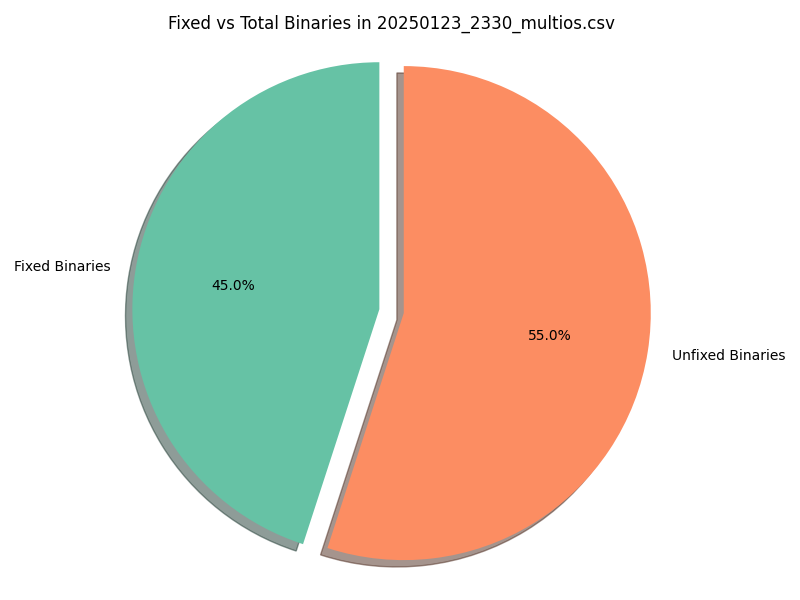

# Multios Binaries Analysis Report

| File | Fixed Binaries | Total Binaries | Ratio |
|------|----------------|----------------|-------|
| 20250319_2344_multios.csv | 9 | 20 | 0.45 |
| 20250422_2353_multios.csv | 9 | 20 | 0.45 |
| 20250413_2339_multios.csv | 9 | 20 | 0.45 |
| 20250418_2359_multios.csv | 9 | 20 | 0.45 |
| 20250308_2349_multios.csv | 9 | 20 | 0.45 |
| 20250404_2355_multios.csv | 9 | 20 | 0.45 |
| 20250320_2342_multios.csv | 9 | 20 | 0.45 |
| 20250330_2340_multios.csv | 9 | 20 | 0.45 |
| 20250325_2356_multios.csv | 9 | 20 | 0.45 |
| 20250218_2334_multios.csv | 9 | 20 | 0.45 |
| 20250205_2327_multios.csv | 9 | 20 | 0.45 |
| 20250401_2352_multios.csv | 9 | 20 | 0.45 |
| 20241218_0538_multios.csv | 9 | 20 | 0.45 |
| 20250208_2334_multios.csv | 9 | 20 | 0.45 |
| 20250126_2319_multios.csv | 9 | 20 | 0.45 |
| 20250425_2351_multios.csv | 9 | 20 | 0.45 |
| 20250509_0147_multios.csv | 9 | 20 | 0.45 |
| 20250204_2335_multios.csv | 9 | 20 | 0.45 |
| 20250129_2324_multios.csv | 9 | 20 | 0.45 |
| 20250407_2340_multios.csv | 9 | 20 | 0.45 |
| 20250504_0221_multios.csv | 9 | 20 | 0.45 |
| 20250227_2341_multios.csv | 9 | 20 | 0.45 |
| 20250217_2346_multios.csv | 9 | 20 | 0.45 |
| 20250505_0142_multios.csv | 9 | 20 | 0.45 |
| 20250408_2345_multios.csv | 9 | 20 | 0.45 |
| 20250329_2336_multios.csv | 9 | 20 | 0.45 |
| 20250510_0156_multios.csv | 9 | 20 | 0.45 |
| 20250415_2344_multios.csv | 9 | 20 | 0.45 |
| 20250219_2349_multios.csv | 9 | 20 | 0.45 |
| 20250222_2346_multios.csv | 9 | 20 | 0.45 |
| 20250223_2344_multios.csv | 9 | 20 | 0.45 |
| 20250215_2335_multios.csv | 9 | 20 | 0.45 |
| 20250303_2354_multios.csv | 9 | 20 | 0.45 |
| 20250419_2359_multios.csv | 9 | 20 | 0.45 |
| 20250121_2317_multios.csv | 9 | 20 | 0.45 |
| 20241219_0540_multios.csv | 9 | 20 | 0.45 |
| 20250120_2321_multios.csv | 9 | 20 | 0.45 |
| 20250309_2345_multios.csv | 9 | 20 | 0.45 |
| 20250316_2342_multios.csv | 9 | 20 | 0.45 |
| 20250312_2337_multios.csv | 9 | 20 | 0.45 |
| 20250225_2348_multios.csv | 9 | 20 | 0.45 |
| 20241221_0541_multios.csv | 9 | 20 | 0.45 |
| 20250323_2343_multios.csv | 9 | 20 | 0.45 |
| 20250503_0140_multios.csv | 9 | 20 | 0.45 |
| 20250321_2343_multios.csv | 9 | 20 | 0.45 |
| 20250327_2346_multios.csv | 9 | 20 | 0.45 |
| 20250202_2331_multios.csv | 9 | 20 | 0.45 |
| 20250128_2316_multios.csv | 9 | 20 | 0.45 |
| 20250424_0001_multios.csv | 9 | 20 | 0.45 |
| 20250302_2338_multios.csv | 9 | 20 | 0.45 |
| 20250428_0057_multios.csv | 9 | 20 | 0.45 |
| 20250206_2334_multios.csv | 9 | 20 | 0.45 |
| 20250224_2337_multios.csv | 9 | 20 | 0.45 |
| 20250131_2318_multios.csv | 9 | 20 | 0.45 |
| 20241222_0542_multios.csv | 9 | 20 | 0.45 |
| 20250119_2153_multios.csv | 9 | 20 | 0.45 |
| 20250216_2332_multios.csv | 9 | 20 | 0.45 |
| 20250209_2340_multios.csv | 9 | 20 | 0.45 |
| 20250213_2329_multios.csv | 9 | 20 | 0.45 |
| 20250501_0109_multios.csv | 9 | 20 | 0.45 |
| 20250130_2320_multios.csv | 9 | 20 | 0.45 |
| 20250502_0125_multios.csv | 9 | 20 | 0.45 |
| 20250325_0000_multios.csv | 9 | 20 | 0.45 |
| 20250331_2346_multios.csv | 9 | 20 | 0.45 |
| 20250226_2340_multios.csv | 9 | 20 | 0.45 |
| 20250402_2341_multios.csv | 9 | 20 | 0.45 |
| 20250506_0209_multios.csv | 9 | 20 | 0.45 |
| 20250228_2337_multios.csv | 9 | 20 | 0.45 |
| 20250311_2340_multios.csv | 9 | 20 | 0.45 |
| 20250124_2345_multios.csv | 9 | 20 | 0.45 |
| 20250116_1915_multios.csv | 9 | 20 | 0.45 |
| 20250304_2340_multios.csv | 9 | 20 | 0.45 |
| 20250424_2338_multios.csv | 9 | 20 | 0.45 |
| 20250125_2315_multios.csv | 9 | 20 | 0.45 |
| 20250426_2343_multios.csv | 9 | 20 | 0.45 |
| 20241217_0540_multios.csv | 9 | 20 | 0.45 |
| 20250212_0026_multios.csv | 9 | 20 | 0.45 |
| 20250212_2330_multios.csv | 9 | 20 | 0.45 |
| 20250123_2330_multios.csv | 9 | 20 | 0.45 |
| 20250403_2355_multios.csv | 9 | 20 | 0.45 |
| 20250420_2348_multios.csv | 9 | 20 | 0.45 |
| 20250214_2340_multios.csv | 9 | 20 | 0.45 |
| 20250414_2345_multios.csv | 9 | 20 | 0.45 |
| 20250221_0301_multios.csv | 9 | 20 | 0.45 |
| 20250417_2343_multios.csv | 9 | 20 | 0.45 |
| 20250322_2335_multios.csv | 9 | 20 | 0.45 |
| 20250409_2344_multios.csv | 9 | 20 | 0.45 |
| 20241220_0539_multios.csv | 9 | 20 | 0.45 |
| 20250406_2341_multios.csv | 9 | 20 | 0.45 |
| 20250405_2343_multios.csv | 9 | 20 | 0.45 |
| 20250412_2343_multios.csv | 9 | 20 | 0.45 |
| 20250317_2344_multios.csv | 9 | 20 | 0.45 |
| 20250421_2338_multios.csv | 9 | 20 | 0.45 |
| 20250315_2347_multios.csv | 9 | 20 | 0.45 |
| 20250122_2325_multios.csv | 9 | 20 | 0.45 |
| 20250318_2338_multios.csv | 9 | 20 | 0.45 |
| 20250301_2341_multios.csv | 9 | 20 | 0.45 |
| 20250307_2341_multios.csv | 9 | 20 | 0.45 |
| 20241225_0540_multios.csv | 9 | 20 | 0.45 |
| 20250429_0123_multios.csv | 9 | 20 | 0.45 |
| 20241223_0543_multios.csv | 9 | 20 | 0.45 |
| 20250127_2315_multios.csv | 9 | 20 | 0.45 |
| 20250314_2344_multios.csv | 9 | 20 | 0.45 |
| 20250207_2331_multios.csv | 9 | 20 | 0.45 |
| 20250410_2343_multios.csv | 9 | 20 | 0.45 |
| 20250305_2344_multios.csv | 9 | 20 | 0.45 |
| 20250201_2331_multios.csv | 9 | 20 | 0.45 |
| 20250313_2347_multios.csv | 9 | 20 | 0.45 |
| 20250306_2334_multios.csv | 9 | 20 | 0.45 |
| 20250203_2335_multios.csv | 9 | 20 | 0.45 |
| 20250310_2349_multios.csv | 9 | 20 | 0.45 |
| 20250221_2346_multios.csv | 9 | 20 | 0.45 |

## Fixed vs Total Binaries for 20250319_2344_multios.csv

## Fixed vs Total Binaries for 20250422_2353_multios.csv

## Fixed vs Total Binaries for 20250413_2339_multios.csv

## Fixed vs Total Binaries for 20250418_2359_multios.csv

## Fixed vs Total Binaries for 20250308_2349_multios.csv

## Fixed vs Total Binaries for 20250404_2355_multios.csv

## Fixed vs Total Binaries for 20250320_2342_multios.csv

## Fixed vs Total Binaries for 20250330_2340_multios.csv

## Fixed vs Total Binaries for 20250325_2356_multios.csv

## Fixed vs Total Binaries for 20250218_2334_multios.csv

## Fixed vs Total Binaries for 20250205_2327_multios.csv

## Fixed vs Total Binaries for 20250401_2352_multios.csv

## Fixed vs Total Binaries for 20241218_0538_multios.csv

## Fixed vs Total Binaries for 20250208_2334_multios.csv

## Fixed vs Total Binaries for 20250126_2319_multios.csv

## Fixed vs Total Binaries for 20250425_2351_multios.csv

## Fixed vs Total Binaries for 20250509_0147_multios.csv

## Fixed vs Total Binaries for 20250204_2335_multios.csv

## Fixed vs Total Binaries for 20250129_2324_multios.csv

## Fixed vs Total Binaries for 20250407_2340_multios.csv

## Fixed vs Total Binaries for 20250504_0221_multios.csv

## Fixed vs Total Binaries for 20250227_2341_multios.csv

## Fixed vs Total Binaries for 20250217_2346_multios.csv

## Fixed vs Total Binaries for 20250505_0142_multios.csv

## Fixed vs Total Binaries for 20250408_2345_multios.csv

## Fixed vs Total Binaries for 20250329_2336_multios.csv

## Fixed vs Total Binaries for 20250510_0156_multios.csv

## Fixed vs Total Binaries for 20250415_2344_multios.csv

## Fixed vs Total Binaries for 20250219_2349_multios.csv

## Fixed vs Total Binaries for 20250222_2346_multios.csv

## Fixed vs Total Binaries for 20250223_2344_multios.csv

## Fixed vs Total Binaries for 20250215_2335_multios.csv

## Fixed vs Total Binaries for 20250303_2354_multios.csv

## Fixed vs Total Binaries for 20250419_2359_multios.csv

## Fixed vs Total Binaries for 20250121_2317_multios.csv

## Fixed vs Total Binaries for 20241219_0540_multios.csv

## Fixed vs Total Binaries for 20250120_2321_multios.csv

## Fixed vs Total Binaries for 20250309_2345_multios.csv

## Fixed vs Total Binaries for 20250316_2342_multios.csv

## Fixed vs Total Binaries for 20250312_2337_multios.csv

## Fixed vs Total Binaries for 20250225_2348_multios.csv

## Fixed vs Total Binaries for 20241221_0541_multios.csv

## Fixed vs Total Binaries for 20250323_2343_multios.csv

## Fixed vs Total Binaries for 20250503_0140_multios.csv

## Fixed vs Total Binaries for 20250321_2343_multios.csv

## Fixed vs Total Binaries for 20250327_2346_multios.csv

## Fixed vs Total Binaries for 20250202_2331_multios.csv

## Fixed vs Total Binaries for 20250128_2316_multios.csv

## Fixed vs Total Binaries for 20250424_0001_multios.csv

## Fixed vs Total Binaries for 20250302_2338_multios.csv

## Fixed vs Total Binaries for 20250428_0057_multios.csv

## Fixed vs Total Binaries for 20250206_2334_multios.csv

## Fixed vs Total Binaries for 20250224_2337_multios.csv

## Fixed vs Total Binaries for 20250131_2318_multios.csv

## Fixed vs Total Binaries for 20241222_0542_multios.csv

## Fixed vs Total Binaries for 20250119_2153_multios.csv

## Fixed vs Total Binaries for 20250216_2332_multios.csv

## Fixed vs Total Binaries for 20250209_2340_multios.csv

## Fixed vs Total Binaries for 20250213_2329_multios.csv

## Fixed vs Total Binaries for 20250501_0109_multios.csv

## Fixed vs Total Binaries for 20250130_2320_multios.csv

## Fixed vs Total Binaries for 20250502_0125_multios.csv

## Fixed vs Total Binaries for 20250325_0000_multios.csv

## Fixed vs Total Binaries for 20250331_2346_multios.csv

## Fixed vs Total Binaries for 20250226_2340_multios.csv

## Fixed vs Total Binaries for 20250402_2341_multios.csv

## Fixed vs Total Binaries for 20250506_0209_multios.csv

## Fixed vs Total Binaries for 20250228_2337_multios.csv

## Fixed vs Total Binaries for 20250311_2340_multios.csv

## Fixed vs Total Binaries for 20250124_2345_multios.csv

## Fixed vs Total Binaries for 20250116_1915_multios.csv

## Fixed vs Total Binaries for 20250304_2340_multios.csv

## Fixed vs Total Binaries for 20250424_2338_multios.csv

## Fixed vs Total Binaries for 20250125_2315_multios.csv

## Fixed vs Total Binaries for 20250426_2343_multios.csv

## Fixed vs Total Binaries for 20241217_0540_multios.csv

## Fixed vs Total Binaries for 20250212_0026_multios.csv

## Fixed vs Total Binaries for 20250212_2330_multios.csv

## Fixed vs Total Binaries for 20250123_2330_multios.csv

## Fixed vs Total Binaries for 20250403_2355_multios.csv

## Fixed vs Total Binaries for 20250420_2348_multios.csv

## Fixed vs Total Binaries for 20250214_2340_multios.csv

## Fixed vs Total Binaries for 20250414_2345_multios.csv

## Fixed vs Total Binaries for 20250221_0301_multios.csv

## Fixed vs Total Binaries for 20250417_2343_multios.csv

## Fixed vs Total Binaries for 20250322_2335_multios.csv

## Fixed vs Total Binaries for 20250409_2344_multios.csv

## Fixed vs Total Binaries for 20241220_0539_multios.csv

## Fixed vs Total Binaries for 20250406_2341_multios.csv

## Fixed vs Total Binaries for 20250405_2343_multios.csv

## Fixed vs Total Binaries for 20250412_2343_multios.csv

## Fixed vs Total Binaries for 20250317_2344_multios.csv

## Fixed vs Total Binaries for 20250421_2338_multios.csv

## Fixed vs Total Binaries for 20250315_2347_multios.csv

## Fixed vs Total Binaries for 20250122_2325_multios.csv

## Fixed vs Total Binaries for 20250318_2338_multios.csv

## Fixed vs Total Binaries for 20250301_2341_multios.csv

## Fixed vs Total Binaries for 20250307_2341_multios.csv

## Fixed vs Total Binaries for 20241225_0540_multios.csv

## Fixed vs Total Binaries for 20250429_0123_multios.csv

## Fixed vs Total Binaries for 20241223_0543_multios.csv

## Fixed vs Total Binaries for 20250127_2315_multios.csv

## Fixed vs Total Binaries for 20250314_2344_multios.csv

## Fixed vs Total Binaries for 20250207_2331_multios.csv

## Fixed vs Total Binaries for 20250410_2343_multios.csv

## Fixed vs Total Binaries for 20250305_2344_multios.csv

## Fixed vs Total Binaries for 20250201_2331_multios.csv

## Fixed vs Total Binaries for 20250313_2347_multios.csv

## Fixed vs Total Binaries for 20250306_2334_multios.csv

## Fixed vs Total Binaries for 20250203_2335_multios.csv

## Fixed vs Total Binaries for 20250310_2349_multios.csv

## Fixed vs Total Binaries for 20250221_2346_multios.csv

