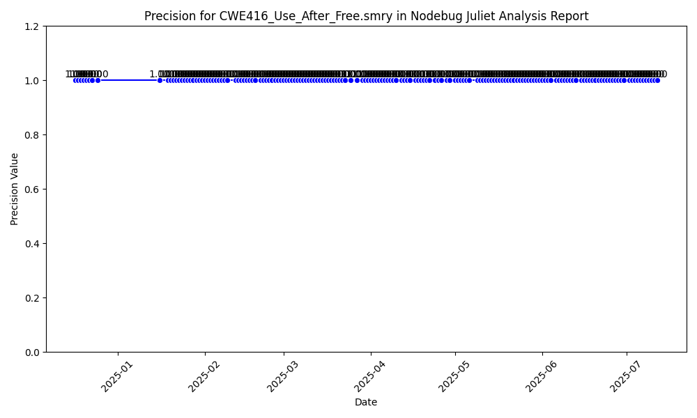
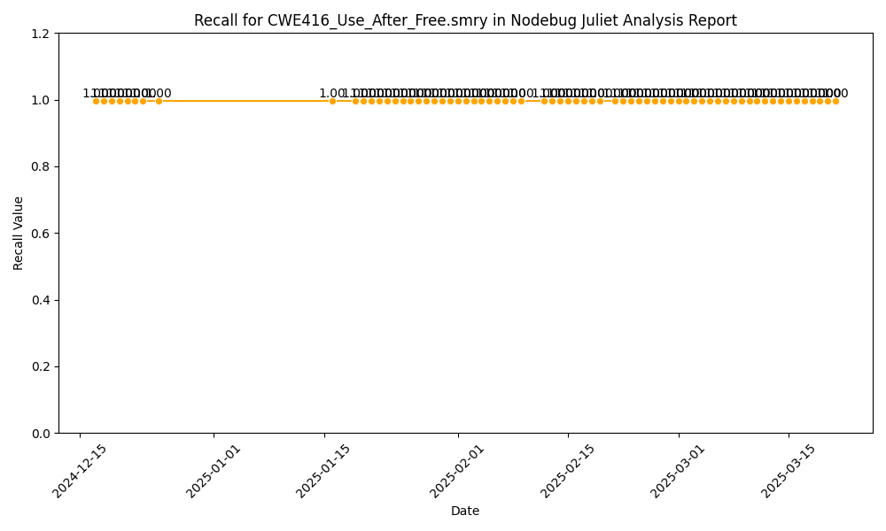
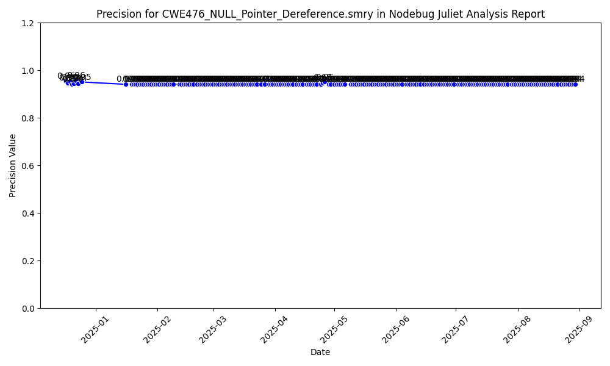
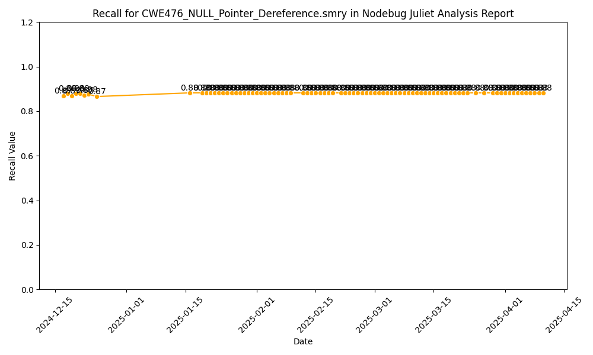
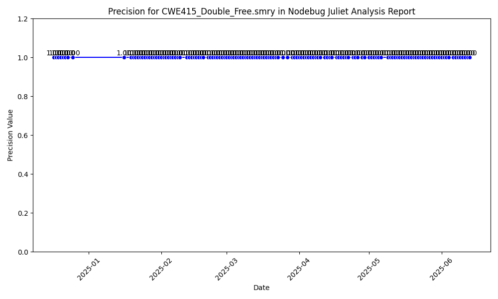
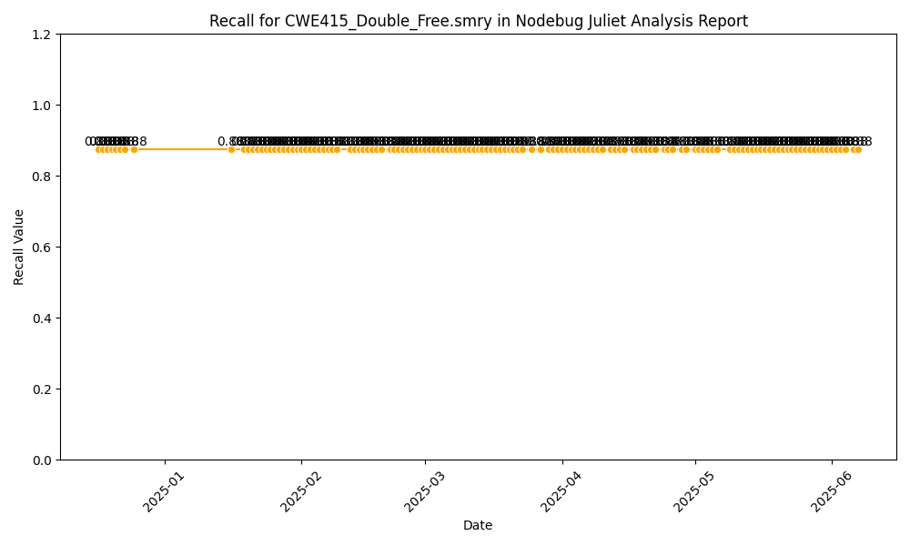

# Nodebug Juliet Analysis Report

| CWE | Average Precision | Average Recall |
|-----|-------------------|----------------|
| CWE416_Use_After_Free.smry | 1.00 | 1.00 |
| CWE476_NULL_Pointer_Dereference.smry | 0.94 | 0.88 |
| CWE415_Double_Free.smry | 1.00 | 0.88 |

## Precision for CWE416_Use_After_Free.smry

## Recall for CWE416_Use_After_Free.smry

## Precision for CWE476_NULL_Pointer_Dereference.smry

## Recall for CWE476_NULL_Pointer_Dereference.smry

## Precision for CWE415_Double_Free.smry

## Recall for CWE415_Double_Free.smry

