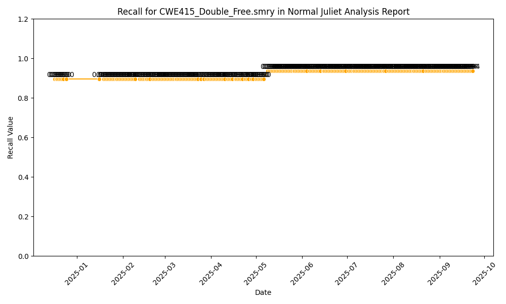
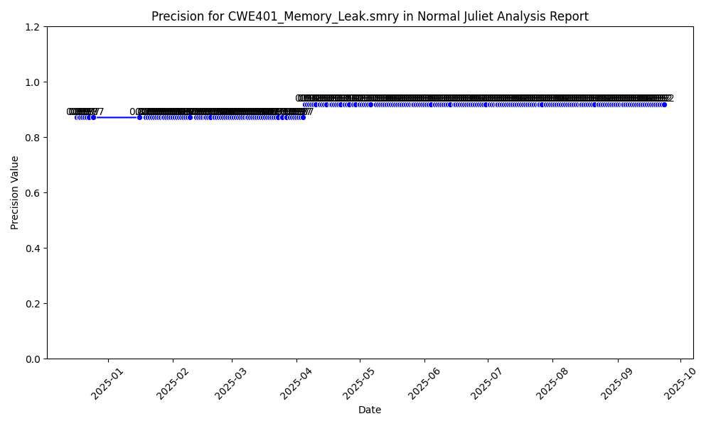
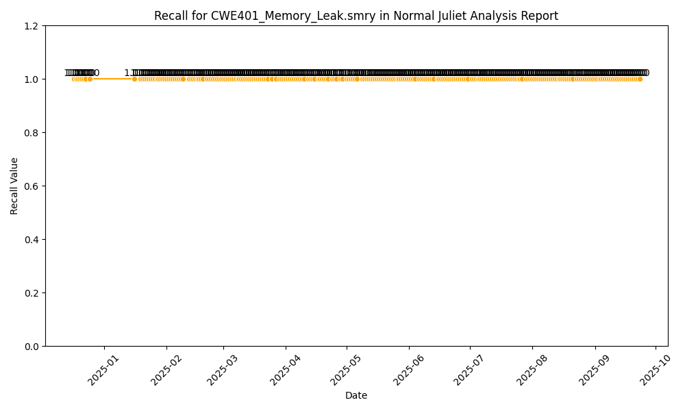
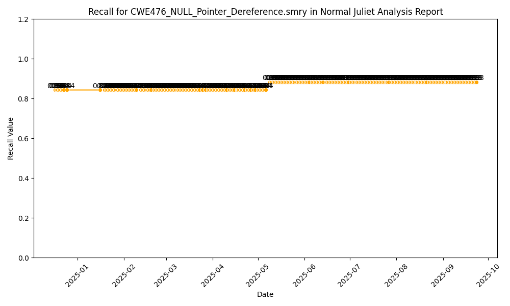
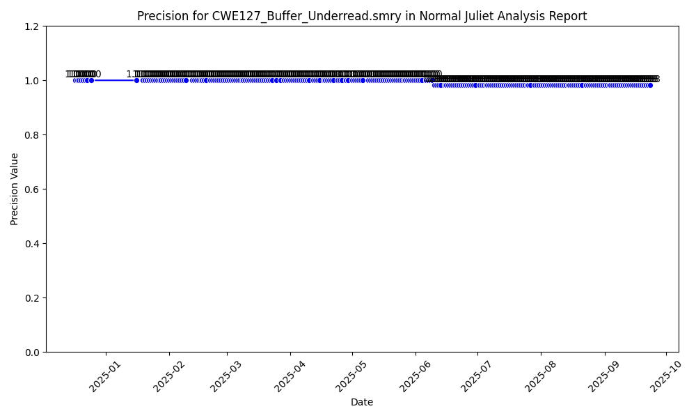
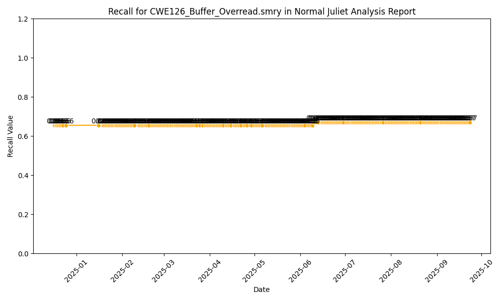
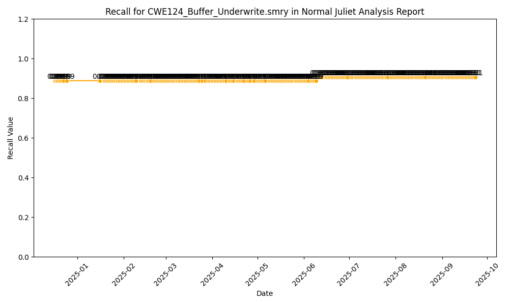
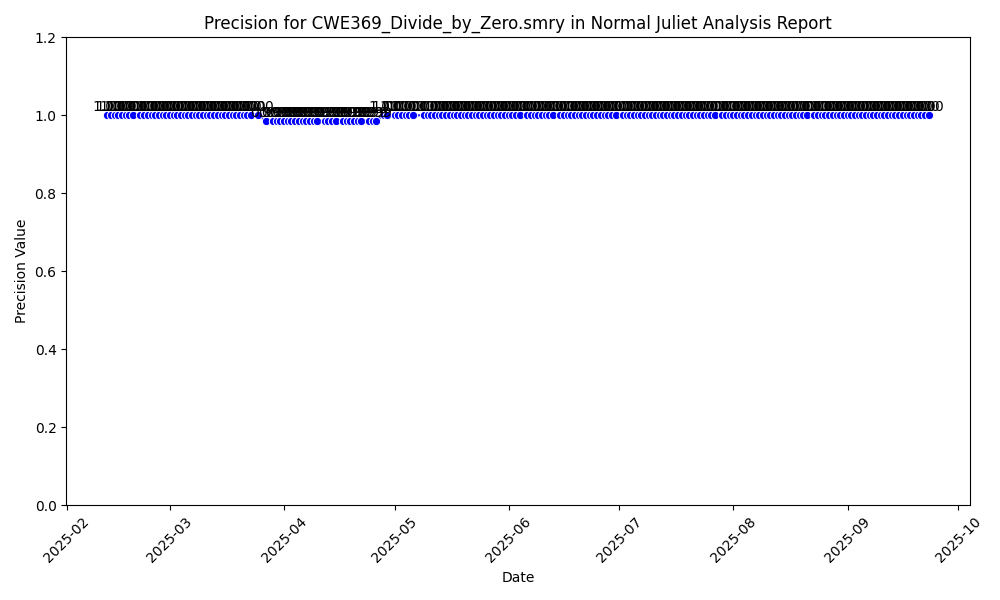

# Normal Juliet Analysis Report

| CWE | Average Precision | Average Recall |
|-----|-------------------|----------------|
| CWE415_Double_Free.smry | 0.98 | 0.92 |
| CWE416_Use_After_Free.smry | 1.00 | 1.00 |
| CWE401_Memory_Leak.smry | 0.90 | 1.00 |
| CWE476_NULL_Pointer_Dereference.smry | 0.98 | 0.86 |
| CWE127_Buffer_Underread.smry | 0.99 | 0.90 |
| CWE126_Buffer_Overread.smry | 0.99 | 0.66 |
| CWE124_Buffer_Underwrite.smry | 0.99 | 0.90 |
| CWE122_Heap_Based_Buffer_Overflow.smry | 0.99 | 0.73 |
| CWE121_Stack_Based_Buffer_Overflow.smry | 0.99 | 0.74 |
| CWE369_Divide_by_Zero.smry | 1.00 | 0.60 |

## Precision for CWE415_Double_Free.smry

## Recall for CWE415_Double_Free.smry

## Precision for CWE416_Use_After_Free.smry

## Recall for CWE416_Use_After_Free.smry

## Precision for CWE401_Memory_Leak.smry

## Recall for CWE401_Memory_Leak.smry

## Precision for CWE476_NULL_Pointer_Dereference.smry

## Recall for CWE476_NULL_Pointer_Dereference.smry

## Precision for CWE127_Buffer_Underread.smry

## Recall for CWE127_Buffer_Underread.smry

## Precision for CWE126_Buffer_Overread.smry

## Recall for CWE126_Buffer_Overread.smry

## Precision for CWE124_Buffer_Underwrite.smry

## Recall for CWE124_Buffer_Underwrite.smry

## Precision for CWE122_Heap_Based_Buffer_Overflow.smry

## Recall for CWE122_Heap_Based_Buffer_Overflow.smry

## Precision for CWE121_Stack_Based_Buffer_Overflow.smry

## Recall for CWE121_Stack_Based_Buffer_Overflow.smry

## Precision for CWE369_Divide_by_Zero.smry

## Recall for CWE369_Divide_by_Zero.smry

